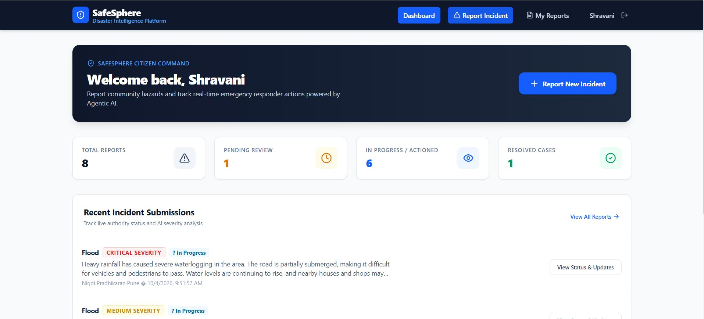
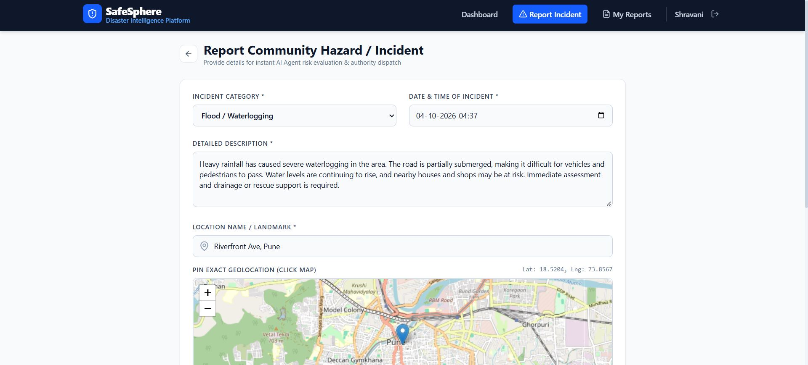
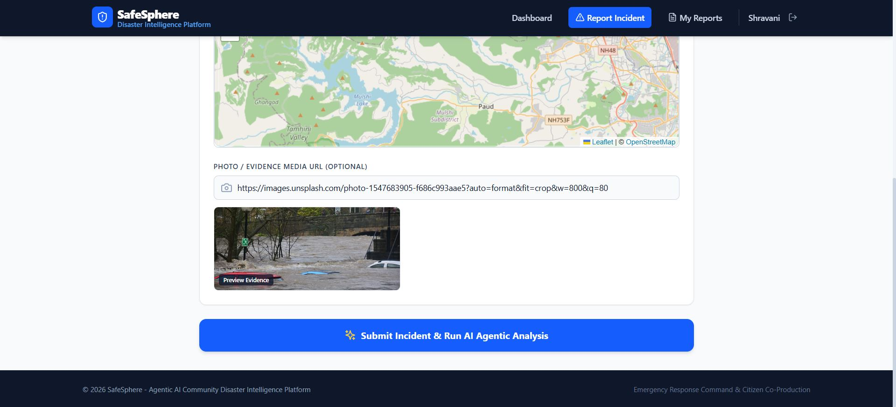
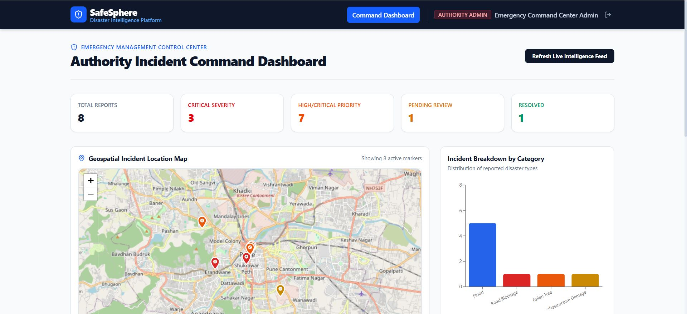
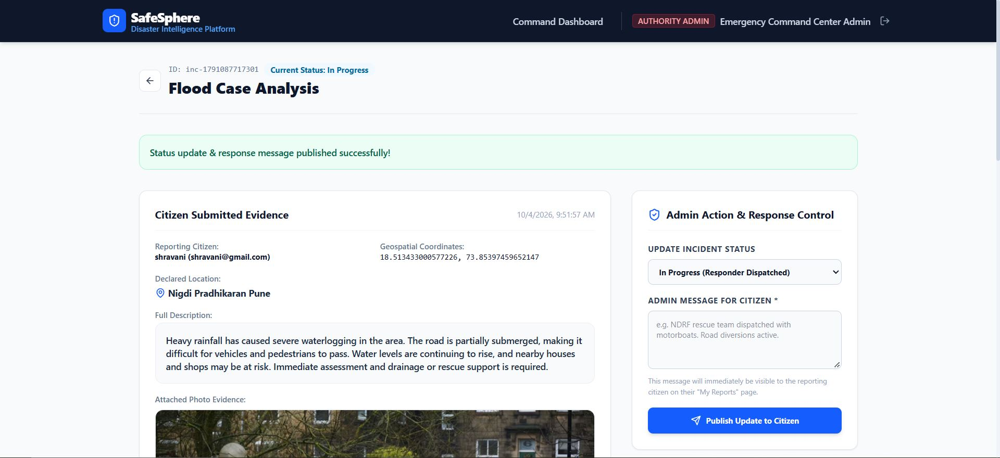
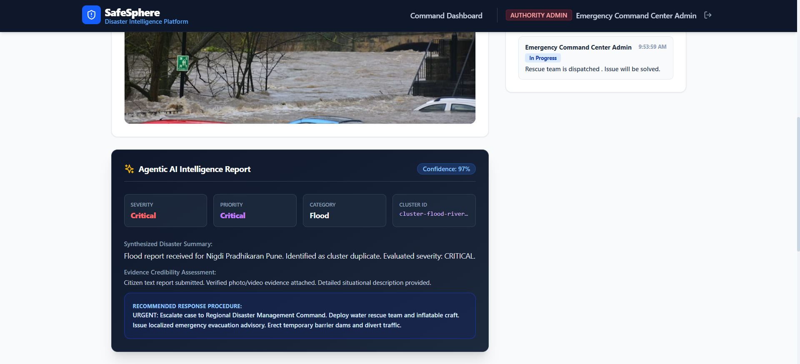

# 🛡️ SafeSphere

### Agentic AI-Powered Community Disaster Intelligence & Response Platform

SafeSphere helps communities report and manage local disasters such as floods, landslides, road blockages, and infrastructure damage.

It connects **citizens with authorities** and uses AI to analyze, verify, cluster, and prioritize incident reports.

---

## 🚨 Key Features

- 👥 **Citizen Portal** — Report incidents and track submissions
- 🏛️ **Authority Dashboard** — Monitor and manage incidents
- 🤖 **AI Intelligence** — Classification, verification, clustering & prioritization
- 🗺️ **Live Incident Map** — Visualize reported incidents
- 🔄 **Status Tracking** — Track incidents from report to response

---

## 🤖 AI Workflow

```text
Citizen Report
      ↓
Incident Analysis
      ↓
Evidence Verification
      ↓
Duplicate & Clustering
      ↓
Severity & Priority
      ↓
Response Coordination
```
---

## 🛠️ Tech Stack

React • Vite • Tailwind CSS • Supabase • Gemini API • Leaflet • Recharts

---

## ⚙️ Setup

```bash
git clone https://github.com/shravanipatil2303/SafeSphere.git
cd SafeSphere/client
npm install
npm run dev

Open http://localhost:3000
Configure the required environment variables before running the application.
```
---

### 📸 Screenshots

#### 👥 Citizen Dashboard


#### 📝 Incident Reporting — Report Form


#### 🤖 Incident Reporting — AI Analysis


#### 🏛️ Authority Dashboard


#### 🚨 Incident Details — Overview


#### 🚨 Incident Details — AI Intelligence
